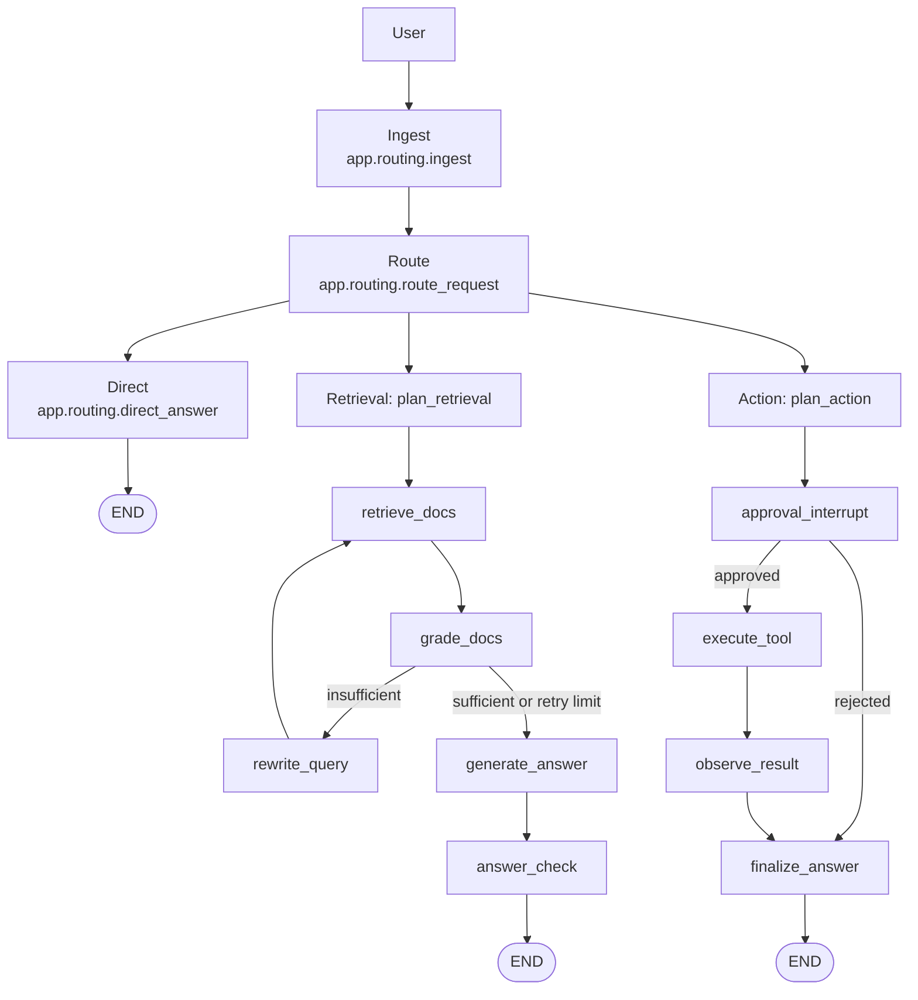
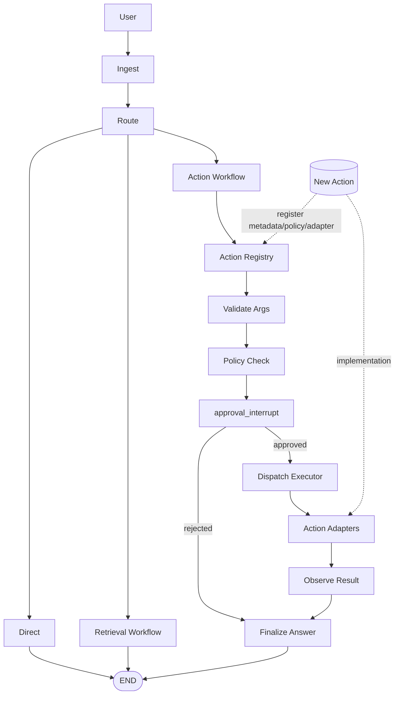

# LangGraph 기반 LLM 오케스트레이션 프로젝트

Python `LangGraph`와 `FastAPI`로 구성한 LLM 오케스트레이션.

## 기술 스택

- Python 3.11+
- LangGraph
- FastAPI
- Uvicorn
- Pydantic

## 실행 방법

```bash
python -m venv .venv
source .venv/bin/activate
pip install -e .
uvicorn app.api:app --reload --host 0.0.0.0 --port 8000
```

## API 엔드포인트

- `GET /health`: 헬스체크
- `POST /threads`: 새 `thread_id` 발급
- `POST /chat`: 대화 실행(필요 시 승인 인터럽트 반환)
- `POST /chat/approval`: 승인/거절 값으로 인터럽트 지점 재개
- `GET /v1/models`: 호환 모델 목록
- `POST /v1/chat/completions`: Chat Completions 호환 API
- `POST /v1/responses`: Responses 호환 API

## 요청 예시

```bash
# 1) thread_id 발급
curl -s http://localhost:8000/threads -X POST

# 2) 일반 질의
curl -s http://localhost:8000/chat -X POST \
  -H "Content-Type: application/json" \
  -d '{"thread_id":"<THREAD_ID>","message":"환불 정책 알려줘"}'

# 3) 액션 질의(승인 필요)
curl -s http://localhost:8000/chat -X POST \
  -H "Content-Type: application/json" \
  -d '{"thread_id":"<THREAD_ID>","message":"고객에게 환불 처리 메일 보내줘"}'

# 4) 인터럽트 재개
curl -s http://localhost:8000/chat/approval -X POST \
  -H "Content-Type: application/json" \
  -d '{"thread_id":"<THREAD_ID>","decision":"approved"}'

# 5) Chat Completions 호환 호출
curl -s http://localhost:8000/v1/chat/completions -X POST \
  -H "Content-Type: application/json" \
  -H "Authorization: Bearer test-key" \
  -d '{
    "model":"corp-gpt",
    "messages":[
      {"role":"developer","content":"답변을 간결하게 해줘"},
      {"role":"user","content":"환불 정책 알려줘"}
    ]
  }'

# 6) Responses 호환 호출
curl -s http://localhost:8000/v1/responses -X POST \
  -H "Content-Type: application/json" \
  -H "Authorization: Bearer test-key" \
  -d '{
    "model":"corp-gpt",
    "instructions":"핵심만 답변해줘",
    "input":"환불 정책 알려줘"
  }'
```

## 프로젝트 구조

```text
app/
  __init__.py
  api.py                  # FastAPI 엔트리포인트
  graph.py                # LangGraph 조립
  state.py                # State 정의
  routing.py              # 요청 분기/플래닝 로직
  retrieval.py            # Retrieval 노드
  action.py               # Action 노드 + interrupt
  tools.py                # 외부 도구 시뮬레이션
  vector_store.py         # 데모 벡터DB
```

## 아키텍처 확장 가이드: 새 Action 추가하기

이 프로젝트의 LangGraph는 크게 **Direct / Retrieval / Action** 3개 경로로 분기됩니다. 핵심은, 새 액션이 생겨도 `app/graph.py`의 코어 흐름(노드/엣지)을 크게 바꾸지 않고, **Action 영역의 확장 포인트**만 늘리는 방식으로 유지보수하는 것입니다.

### 1) 현재 아키텍처(실제 코드 기준)

- 진입: `ingest` → `route` (`route_request`)에서 경로 결정. (`app/routing.py`)
- Retrieval 경로: `plan_retrieval` → `retrieve_docs` → `grade_docs` → (`rewrite_query` 루프 가능) → `generate_answer` → `answer_check`. (`app/retrieval.py`)
- Action 경로: `plan_action` → `approval_interrupt` → (`route_after_approval`) → `execute_tool` → `observe_result` → `finalize_answer`. (`app/action.py`)
- 체크포인트/재개: `build_app()`가 `MemorySaver()` 체크포인터로 그래프를 컴파일하고, API에서는 `thread_id`를 config에 넣어 동일 스레드 컨텍스트로 `invoke`/`Command(resume=...)`를 수행. (`app/graph.py`, `app/api.py`)



### 2) 왜 Action 확장은 코어 그래프를 비대하게 만들면 안 될까?

Action 종류가 늘어날 때마다 `graph.add_node(...)`/엣지를 계속 추가하면:
- 그래프 가독성이 빠르게 떨어지고,
- 승인 정책/인자 검증/실행 어댑터가 경로별로 중복되며,
- Retrieval 같은 다른 경로와 결합도가 높아집니다.

현재 코드도 이 방향을 이미 보여줍니다. Retrieval 파이프라인은 독립적이고, Action은 `plan_action`과 `execute_tool` 중심으로 묶여 있습니다. 즉, 새 Action 추가 시에도 **Retrieval 플로우는 그대로 유지**하는 것이 바람직합니다.

### 3) 새 Action을 추가할 때 바뀌는 곳 vs 유지되는 곳

**대부분 유지되는 곳(기본적으로 변경 없음)**
- 라우팅의 큰 틀: `route_request`, `route_after_ingest` (`app/routing.py`)
- Retrieval 전체: `app/retrieval.py`
- Action의 상위 단계 순서: `plan_action` → `approval_interrupt` → `execute_tool` → `observe_result` → `finalize_answer` (`app/action.py`)
- 체크포인터/스레드 재개 메커니즘: `MemorySaver`, `thread_id`, `Command(resume=...)` (`app/graph.py`, `app/api.py`)

**확장 포인트(새 Action 추가 시 주로 수정)**
- Action 메타데이터(이름, 필요한 인자, 위험도 규칙)
- 인자 검증 로직
- 정책/승인 조건
- 실제 외부 실행 어댑터(또는 도구 함수)
- 액션 결과를 관찰(observe)해 최종 응답으로 연결하는 포맷

아래 다이어그램은 현재 코드의 Action 경로를, 액션 수 증가에 대비해 내부 책임 단위로 분해한 **확장 구조(설계 가이드)** 입니다.



> 참고: 위 확장 다이어그램의 `Action Registry / Validate Args / Policy Check / Dispatch Executor / Action Adapters`는 현재 저장소에 별도 모듈로 완전히 분리되어 있지는 않습니다. 현재는 `plan_action` + `execute_external_tool` 내부 분기(`if action == ...`)로 단순 구현되어 있습니다. (`app/action.py`, `app/tools.py`)

### 4) 용어를 쉽게 정리

- **approval_interrupt**: 위험한 작업 실행 전에 그래프를 잠시 멈추는 지점입니다. 사람(운영자)이 `approved`/`rejected`를 넣어야 다음으로 진행합니다. (`app/action.py`)
- **thread_id**: 대화/작업 세션 ID입니다. 같은 `thread_id`를 쓰면 중단된 지점에서 이어서 실행할 수 있습니다. (`app/api.py`)
- **checkpoint / checkpointer**: 그래프 중간 상태를 저장하는 장치입니다. 지금은 `MemorySaver`(메모리 기반)라 프로세스 재시작 시 상태가 사라집니다. (`app/graph.py`)
- **action registry**: 어떤 액션이 가능한지(이름, 인자, 정책)를 모아두는 목록입니다. (현재는 암묵적으로 `plan_action`/`tools.execute_external_tool`의 조건 분기로 표현)
- **adapter**: 액션 이름을 실제 외부 API 호출 코드로 연결하는 얇은 계층입니다. (현재는 `execute_external_tool`이 이 역할)
- **dispatcher**: 액션 이름/타입을 보고 어떤 실행 함수를 호출할지 분기하는 로직입니다. (현재는 `execute_external_tool` 내부 `if action == ...` 분기)

### 5) 새 Action 추가 예시 (현재 코드 패턴 기반)

아래는 현재 구조를 유지하면서 `create_support_ticket` 액션을 추가하는 **구체적 구현 포인트**입니다.

1. **액션 메타데이터/스키마 정의**
   - 현재는 전용 스키마 클래스가 없으므로 `action_plan` 딕셔너리 키를 명확히 합의합니다.
   - 예: `{"action": "create_support_ticket", "target": "ops", "reason": "...", "priority": "high"}`
   - 구현 위치: `plan_action`에서 해당 shape를 생성. (`app/action.py`)

2. **액션 등록(현재 패턴에서는 분기 추가)**
   - `plan_action`의 의도 분류 분기에 새 액션 후보를 추가합니다.
   - 예: 사용자 입력에 "장애", "티켓", "등록"이 포함되면 `action="create_support_ticket"` 설정.

3. **검증 규칙 추가**
   - 현재는 별도 `validate_args` 노드가 없으므로, 초기 단계에서는 `plan_action` 또는 `execute_tool` 직전에 필수 키 검증을 수행합니다.
   - 예: `priority`가 `low|medium|high` 중 하나인지 확인.
   - 검증 실패 시 `tool_result.status="noop"` + 상세 에러를 내려 `observe_result`/`finalize_answer`로 전달.

4. **정책/승인 규칙 연결**
   - 고위험 작업은 기존처럼 `approval_interrupt`를 반드시 거칩니다.
   - 현재 그래프는 Action 경로 전체가 `approval_interrupt`를 통과하므로 새 액션도 자동으로 동일 정책을 적용받습니다. (`app/graph.py`)

5. **adapter/executor 구현 포인트**
   - `app/tools.py`의 `execute_external_tool`에 `if action == "create_support_ticket": ...` 분기를 추가해 외부 시스템 호출(또는 시뮬레이션)을 구현합니다.
   - 반환 포맷은 기존과 동일하게 `status/action/detail/executed_at`를 유지하면 후속 단계 재사용이 쉽습니다.

6. **결과가 최종 응답으로 흐르는 방식**
   - `execute_tool`이 `tool_result` 저장 → `observe_result`가 요약 문자열 생성 → `finalize_answer`가 사용자 응답 생성.
   - 즉, 새 액션도 결과 shape만 맞추면 기존 `observe_result`/`finalize_answer`를 대부분 수정 없이 재사용할 수 있습니다. (`app/action.py`)

### 6) 구현 체크리스트 (신규 엔지니어용)

- [ ] `app/action.py::plan_action`에 새 액션 계획 생성 규칙 추가
- [ ] (선택) `app/action.py`에 인자 검증 보조 함수 추가
- [ ] `app/tools.py::execute_external_tool`에 새 액션 실행 분기 추가
- [ ] 실행 결과 dict 키(`status`, `action`, `detail`, `executed_at`) 일관성 확인
- [ ] `/chat`로 인터럽트 발생 확인 후 `/chat/approval`에서 승인/거절 둘 다 테스트
- [ ] Retrieval 질문이 기존처럼 동작하는지 회귀 확인 (`route_request`에서 retrieval 분기)

